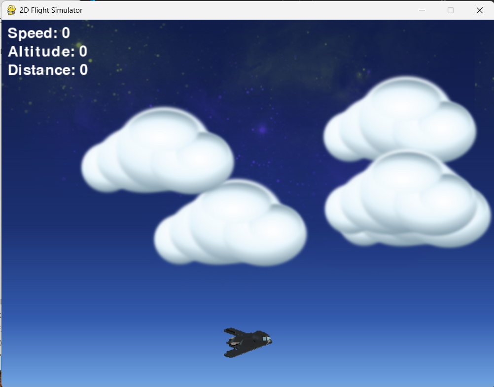
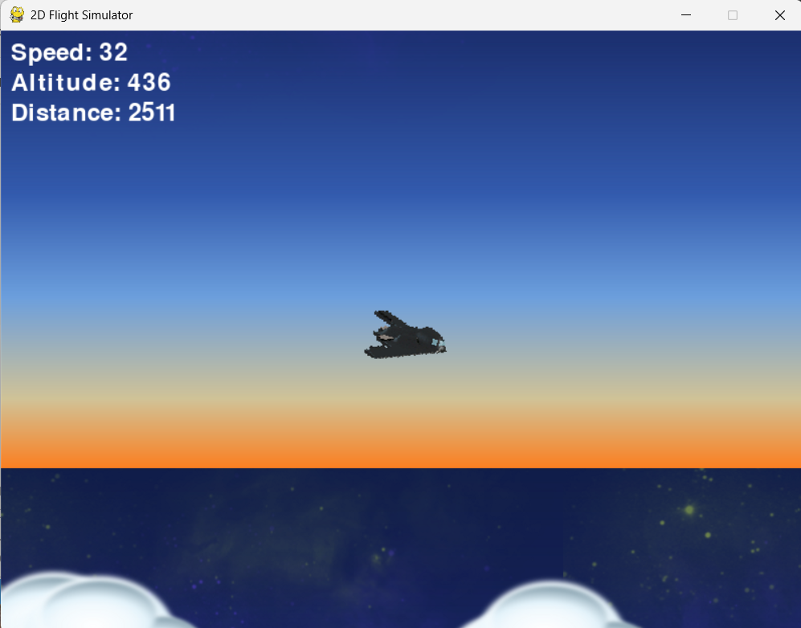

# 2D Flight Simulator Game

Welcome to the **2D Flight Simulator Game**! This project simulates an arcade-style flight experience where the player pilots a plane, starting from the ground and taking off into the skies. The game is designed in Python using the **Pygame library**, with rich graphics sourced from the [War on Water GFX](https://opengameart.org/content/war-on-water-gfx).

---

## Game Features

### Core Features:
- **Takeoff Mechanics**: The plane starts on the ground and requires sufficient speed to take off.
- **Realistic Movement**: Includes horizontal thrust, vertical lift, drag, and gravity to make the flight more immersive.
- **Maximum Speed Limit**: Simulated based on the B-2 Bomber with a top speed of ~628 mph.
- **Heads-Up Display (HUD)**: Displays real-time data including the plane's current speed, altitude, and distance traveled.
- **Infinite Scrolling Background**: Creates the illusion of an open sky.

### Game Dynamics:
1. **Ground Movement**: Use the `Right Arrow` key to accelerate. The plane requires at least 4 units of speed to lift off.
2. **Takeoff**: Press the `Up Arrow` key at sufficient speed to begin flight.
3. **Flight Control**:
   - `Right Arrow`: Increase speed.
   - `Left Arrow`: Decrease speed.
   - `Up Arrow`: Tilt up (ascend).
   - `Down Arrow`: Tilt down (descend).

---

## Gameplay Instructions

### Starting the Game:
1. Download and install [Python](https://www.python.org/).
2. Install Pygame:
   ```bash
   pip install pygame
   ```
3. Run `main.py`:
   ```bash
   python main.py
   ```

### Objective:
- Keep the plane airborne while navigating through the skies. Practice takeoffs and manage your speed, altitude, and movement.

---

## Controls

| Key          | Action                     |
|--------------|----------------------------|
| **Right**    | Increase thrust/speed      |
| **Left**     | Reduce thrust/speed        |
| **Up**       | Tilt upward                |
| **Down**     | Tilt downward              |

---

## Assets and Attribution

Graphics for this game were sourced from the [War on Water GFX](https://opengameart.org/content/war-on-water-gfx). It includes plane sprites and environmental graphics.

---

## File Overview

### Game Structure

```plaintext
flight_simulator/
├── main.py          # Main script for the game logic
├── README.md        # Game documentation
├── assets/          # Game assets (images, sounds)
│   ├── plane.png    # Plane sprite for the player
│   ├── cloud.png    # Cloud obstacles
│   └── background.png # Sky background image
```

---

## How to Modify

### Customize Graphics:
Replace or add new sprites for the plane or environment by modifying files in the `assets/` directory.

### Tune Physics:
Adjust constants in `main.py`:
- `thrust`: Affects speed gain.
- `drag`: Manages air resistance.
- `lift`: Controls how much upward momentum is applied when ascending.
- `gravity`: Sets the pull downward.

### Maximum Speed:
Update `MAX_SPEED` in `main.py` to change the plane's top speed.

---

## Screenshots

Placeholder for in-game screenshots.




*(Image credit: War on Water GFX)*

---

## License

This game is licensed under the [MIT License](https://opensource.org/licenses/MIT). The assets are used under the terms listed on the [OpenGameArt.org](https://opengameart.org/) website.


[def]: image.png
